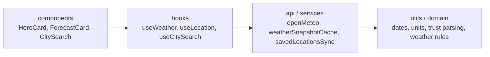

# Aura Weather

Aura Weather is a polished React weather dashboard built for fast scanning, resilient data handling, and a calm day-planning experience.

The portfolio story is simple: **Aura never turns missing provider data into fake certainty.** If Open-Meteo returns a missing reading, the UI shows that value as unavailable, explains why, and keeps the rest of the forecast usable.

## Live Demo

- Production: [aura-weather-platform.netlify.app](https://aura-weather-platform.netlify.app/)
- Local dev: `npm run dev`
- Trust-contract demo: open `/?mock=missing`

## Feature Snapshot

- Search any city with an abortable, keyboard-friendly combobox.
- Resolve browser GPS into a friendly place label instead of a generic "Current location" tag.
- Show `Recent` and `Saved` locations as distinct sections in the search dropdown.
- View current conditions, hourly outlook, rain guidance, risk signals, and a 7-day forecast.
- Expand any forecast day for high/low, rain chance, UV, wind, and sunrise/sunset details.
- Compare today's temperature against historical Open-Meteo archive context when available.
- See NOAA/NWS severe-alert coverage with explicit unsupported-region messaging.
- Restore a last-known forecast on offline starts without pretending stale data is fresh.
- Save cities, persist a startup location, and optionally sync saved locations.
- Toggle Fahrenheit/Celsius locally without refetching forecast data.
- Install the app shell as a PWA after a first successful production visit.

## Screenshots

Screenshots are committed and regenerated by Playwright instead of hand-captured so the portfolio images stay reproducible.


<p align="center">
  
  
</p>

Regenerate with `npm run screenshots`.

## Tech Stack

- React 19
- Vite 6
- Lucide React
- Plain CSS
- Playwright + axe-core
- Open-Meteo APIs

## Technical Highlights

- **Data trust contract:** strict numeric parsing prevents `Number(null) === 0` bugs from becoming fake weather readings.
- **Independent fetch lifecycles:** forecast, AQI/alerts, and climate archive requests can succeed or fail separately.
- **Accessible dashboard states:** loading, cached, unavailable, unsupported, and missing-data states are visible and announced.
- **Portfolio-grade QA:** unit, render, E2E, visual regression, axe, and Lighthouse checks cover the core experience.

## Architecture at a Glance



```text
src/
  api/                       # Open-Meteo + NWS fetch adapters
    openMeteo.js             #   forecast, archive, AQI, geocode, alerts
    transforms.js            #   raw → AppWeatherModel normalization
    types.js                 #   model schema + skeleton factory
  domain/                    # Pure weather classification logic
    weatherCodes.js          #   WMO code → label/icon/gradient
    weatherScene.js          #   forecast + loading + error → UI scene
    meteorology.js           #   storm risk, pressure trend, comfort
    aqi.js  wind.js  temperature.js
  hooks/                     # React orchestration + persistence
    useWeatherDashboardViewModel.js  # composes the dashboard hook bag
    useWeather.js            #   location + saved-cities + sync
    useWeatherData.js        #   forecast + supplemental fetch lifecycle
    useClimateComparison.js  #   historical archive lifecycle
    useLocation.js           #   geolocation + persisted/saved cities
    useSavedLocationsSync.js #   pull/push cloud sync orchestration
    useCitySearch.js         #   debounced abortable geocoder
    useRainAnalysis.js  useDeferredMount.js  useDisplayPreferences.js
    useLocalStorageState.js  useAppShellEffects.js
    climateComparison.js  savedLocationsSyncHelpers.js   # pure helpers
  components/                # React surface
    layout/                  #   AppShell, AppHeader, StatusStack,
                             #   WeatherDashboard, SupplementalWeatherPanels
    header/                  #   Saved cities, sync panel, display settings
    ui/                      #   Card primitives, DataTrustMeta, InfoDrawer
    HeroCard, RainCard, ForecastCard, NowcastCard,
    StormWatch, HourlyCard, AlertsCard, ExposureSection,
    CitySearch, WeatherIcon, AppErrorBoundary
  services/                  # Cross-cutting services
    savedLocationsSync.js    #   sync key + jsonblob persistence
    weatherSnapshotCache.js  #   last-successful forecast restore cache
    serviceWorkerRegistration.js # production-only PWA registration
  utils/                     # Pure helpers
    numbers.js               #   strict toFiniteNumber (rejects null)
    weatherUnits.js  meteorology.js  dates.js  dataTrust.js
    sunlight.js  timeSeries.js  weatherCodes.js  temperature.js
```

The app keeps UI, orchestration, provider access, and pure weather logic separated. Each layer has a strict dependency direction:
`components → hooks → api/services → utils/domain`. Components never
fetch directly; hooks never compute UI gradients; the API layer
never imports a React module.

## Running Locally

1. Install dependencies:

```bash
npm ci
```

2. Copy the optional env file if you want key-based sync URLs:

```bash
Copy-Item .env.example .env
```

3. Start the dev server:

```bash
npm run dev
```

4. Open `http://127.0.0.1:5173`

## Environment Variables

Aura works without API keys for weather data.

Optional variables:

| Variable | Required | Purpose |
| --- | --- | --- |
| `VITE_AURA_SYNC_API_BASE` | No | Base URL for saved-location sync when users enter a short key instead of a full sync URL |

If `VITE_AURA_SYNC_API_BASE` is not set, sync still works when the stored account value is a full URL.

## Future Improvements

- Add richer favorite controls such as pinning or reordering saved cities.
- Tune production performance against live provider latency, not only the deterministic demo route.
- Expand the case study with side-by-side mobile/desktop annotations of the trust-contract state.

## Validation

```bash
npm run lint
npm test
npm run build
npm run test:e2e
npm run test:visual
npm run test:lighthouse
```

### Latest local QA snapshot

- `npm run lint` passes
- `npm test` passes (`249` tests across 55 suites, including React render tests via `jsdom` + `esbuild`)
- `npm run build` passes
- `npm run test:e2e -- --workers=1` passes (`28` Playwright checks, including smoke, screenshots, visual baselines, cached offline restore, offline app-shell reload, honest GPS labels, missing-data placeholder guard, demo-provider guard, unicode-escape leak guard, and axe-core a11y)
- `npm run test:lighthouse` passes the local app-shell budget gate against the labelled `?mock=missing` demo route
- GitHub Actions runs lint, tests, render tests, build, serial Playwright, and Lighthouse budgets on pull requests

### Current automated coverage

- Node tests for:
  - API model contracts
  - primary forecast and geocoder retry behavior
  - alert coverage fallback behavior
  - saved-forecast restore cache freshness
  - saved-location sync normalization and error handling
  - location persistence helpers
  - weather domain utilities and formatters
- Playwright smoke coverage for:
  - dashboard boot
  - granted browser coordinates reverse-geocoded into a friendly place label
  - city search and location switching
  - recent and saved location sections on empty search focus
  - expandable forecast-day details
  - cloud sync staying hidden until a saved city exists
  - search loading feedback before empty-result states resolve
  - unit switching without refetching forecast/climate data
  - failed cloud-sync connection attempts staying disconnected with an explicit error
  - removing the active saved city clearing persisted startup-location storage
  - unsupported-region severe alert fallback
  - missing-data demo route avoiding live provider requests
  - production service worker restoring the app shell after an offline reload
  - mobile overflow regression
  - regression guard ensuring no literal `\uXXXX` escape sequences leak into rendered text
  - axe-core accessibility scan on the live dashboard (`/`) and the trust-contract state (`?mock=missing`)
  - assistive-tech cue check for the missing-data trust contract (`role="status"` helper note + `aria-label="No data available"` on the missing stat)
- Playwright visual baselines for:
  - desktop / tablet / mobile dashboard
  - desktop / mobile `?mock=missing` (trust-contract) state

## Demo Expectations

- First load opens to a usable Chicago forecast immediately instead of stalling on a geolocation permission prompt.
- Initial loading uses a lightweight dashboard skeleton and provider status copy rather than fake forecast values.
- Browser location is opt-in. Users can keep the fallback city, search manually, or grant location access.
- Device-location success upgrades to a friendly nearby place label when reverse geocoding succeeds.
- Core weather data loads first. Air quality, alerts, and climate context can recover independently if a secondary API is slow or unavailable.
- The hero summarizes daily decisions from real forecast data: rain gear, UV exposure, and wind comfort. Missing source data is labelled unavailable, not guessed.
- Mobile rain and hourly cards expose touch-friendly sample controls so users can inspect dense timelines without relying on hover.
- Saved cities appear as search suggestions on focus, so repeat switching does not require typing.
- Search shows a loading state before empty results, so users do not get a premature "No matching cities" response.
- Startup-city controls stay hidden until a startup preference actually exists.
- Cloud sync stays out of the header until a saved city exists, while existing connected/error states still remain recoverable.
- Failed cloud sync connection attempts surface an error and stay disconnected instead of leaving a stale connected-looking state.
- Cloud sync is optional and intentionally secondary to the main forecast workflow.
- After a successful production visit, the service worker can serve the app shell offline and acknowledges when the shell is ready; live weather API failures still surface through the saved-forecast trust state instead of pretending fresh data exists.
- Supported browsers surface an optional "Install Aura" prompt for faster daily access without blocking the forecast workflow.

## Accessibility Notes

- Skip link to main content
- Visible focus states
- Keyboard-searchable city combobox
- Live status messaging for loading and refresh states
- Reduced-motion-safe card visibility and transitions
- Updated mobile touch targets for smaller utility controls and dense rain/hourly timelines

## Architecture Decisions

Short notes on the non-obvious choices a reviewer might question.

- **Forecast is always fetched in Fahrenheit / inch units; conversion is client-side.** Switching the °F/°C toggle must not trigger a refetch — it would invalidate the displayed timestamp and confuse users. A Playwright test asserts that toggling units does not refetch.
- **Three independent fetch tracks.** Forecast, supplemental (AQI + alerts), and climate-archive run concurrently with separate AbortController + request-id pairs. A slow archive call cannot delay the hero card; an alerts feed outage cannot wipe the AQI reading.
- **Retries stay source-scoped.** Forecast, geocoding, AQI, alerts, and archive calls retry transient failures on their own clocks, while known coverage misses such as NWS 400/404 responses stay explicit unsupported-region states.
- **Cached forecasts have a daily freshness window.** Aura can restore a last-known snapshot when the browser starts offline, but snapshots older than 12 hours are ignored so the app does not present stale weather as daily guidance.
- **NWS alerts are U.S.-only by design.** A 400/404 from `api.weather.gov/alerts/active` is mapped to an explicit `unsupported` status (not `unavailable`) so the UI can say "Alerts unavailable for this region" instead of an ambiguous "no alerts".
- **Strict numeric coercion at every layer.** `Number(null) === 0` would surface as a fake 0°F humidity / 0% rain chance / 0°F historical sample whenever Open-Meteo returns a missing data point. A single shared `toFiniteNumber` helper rejects nullish, empty-string, boolean, array, and object inputs explicitly, and is now applied at the API boundary, every formatter, every domain classifier, and every chart slot parser. Eight unit tests lock the core helper; additional assertions pin the null contract for each formatter and domain function.
- **Lazy supplemental panels.** The hero, exposure cards, and rain card render synchronously. Hourly chart, storm watch, alerts, forecast, and nowcast are mounted via `Suspense` after a `requestIdleCallback` (or 180ms fallback) so the first paint is just the data the user sees first.
- **CSS lives next to its component.** App.css holds only global tokens, resets, animations, and one shared focus-visible rule used across header buttons and retry buttons. Every feature's CSS is imported by its owning component.

## Data Trust Contract

Aura makes one promise loudly: **a missing reading is shown as missing,
never as zero.** A weather dashboard that silently turns a null humidity
into "0%" or a missing dew point into "0°F" is worse than one that says
"unavailable" — it converts a known unknown into a confidently wrong
reading. The audit pass for this project found and closed every place
where a `Number(null) === 0` coercion could surface as a fake reading.

A short demo of the toggle (live forecast → `?mock=missing` → "—"
placeholders, helper note, and `Stat` primitive's missing modifier):

<video src="docs/screenshots/trust-contract-demo.webm" controls muted loop playsinline width="720">
  Your browser does not render embedded video. Run
  <code>npm run record:trust-contract-demo</code> to regenerate
  <code>docs/screenshots/trust-contract-demo.webm</code>, or open
  <code>http://127.0.0.1:5173/?mock=missing</code> on a local dev
  server to see the trust-contract state directly.
</video>

The contract is enforced at four layers:

1. **API boundary** — `src/utils/numbers.js` exports a strict
   `toFiniteNumber(value)` helper that rejects null, undefined,
   empty/whitespace strings, booleans, and arrays/objects explicitly.
   `transforms.js` and `openMeteo.js` route every nullable field
   through it, so the normalized `AppWeatherModel` carries `null` for
   missing fields — never `0`.
2. **Per-element parsers** — `HourlyCard`, `ForecastCard`,
   `NowcastCard`, and `useRainAnalysis` each parse Open-Meteo's
   per-slot arrays through `toFiniteNumber` so a single null entry
   becomes a chart gap rather than a fake `0°F` point. The
   coordinate parser, the trust-meta age clock, and `convertTemp`
   carry the same guarantee.
3. **Component fallback rendering** — every consumer that displays a
   value falls back to the em-dash placeholder (`—`) when its input
   is non-finite. The hero card hides the unit suffix on the missing
   path (no more `—°F`), and a small helper note on the card
   explains *why* a value is missing instead of leaving the user to
   guess.
4. **Visual + screen-reader cue** — the `Stat` primitive auto-detects
   the em-dash placeholder and applies an `.is-missing` modifier
   (muted color, normal weight) plus an `aria-label="No data
   available"` so assistive tech announces "no data available"
   instead of speaking the literal "em dash" character.

The contract is locked in by tests at every layer:

- **Unit (`numbers.test.mjs`, 8 tests)** — `toFiniteNumber` rejects
  null, undefined, empty strings, booleans, arrays, objects, and
  `NaN`/`Infinity`.
- **Integration (`transforms.test.mjs`, 6 tests)** —
  `normalizeWeatherResponse` preserves null current readings end-to-end.
- **API (`openMeteo.test.mjs`)** —
  `fetchHistoricalTemperatureAverage` drops null and empty-string
  archive samples instead of averaging them as 0°F.
- **React render (`HeroCard.render.test.mjs`, 6 tests)** — the
  rendered DOM contains no `0%`, `0 hPa`, or `—°F` leaks; every
  missing value carries the `.is-missing` modifier and the "No data
  available" announcement; the helper note appears when any hero
  stat is missing.
- **End-to-end (`weather-smoke.spec.js`)** — a Playwright check
  overrides the forecast mock to return null humidity and pressure,
  asserts the hero card renders `—` with `.is-missing` and explicitly
  asserts `0%` / `0 hPa` are not in the rendered text.

To reproduce the missing-data state on demand (for screenshots or
manual QA), open `/?mock=missing`. This is a labelled portfolio demo
state, not a silent production override: the app shows a demo notice
and uses `src/mocks/missingData.js` instead of querying live providers.
The current temperature stays plausible so the dashboard still looks
like a working forecast; the point is that every other field degrades
gracefully. A dev-only fetch patch remains in
`src/dev/missingDataMock.js` for lower-level endpoint QA.

## How this was audited

Aura Weather went through a structured audit pass with a senior
frontend engineer, UX reviewer, and hiring-manager hat on. Every
batch followed the same six-step rhythm:

1. **Stabilize** any obvious runtime bug or crash path.
2. **Improve architecture** — duplicated logic, oversized hooks,
   weak folder organisation.
3. **Strengthen product logic** — missing-data fallbacks, retry
   behaviour, persistence, recovery states.
4. **Improve UX/UI** — mobile responsiveness, hierarchy, empty/error
   states, accessibility, trust cues.
5. **Testing and QA** — unit, integration, render, and E2E.
6. **Portfolio readiness** — README, known limitations, case study
   notes, recruiter-facing project narrative.

A full ledger of the changes shipped during the audit is in
[`CHANGELOG.md`](./CHANGELOG.md). The single strongest narrative is
the [Data Trust Contract](#data-trust-contract) — a load-bearing rule
that a missing reading is shown as missing, never as zero, and the
four enforcement layers + four test layers that make it true. There
is a longer write-up in
[`docs/case-study.md`](./docs/case-study.md) that walks through the
bug, the contract, and the test pyramid.

## Recent Hardening

- **Saved-city-first sync** - Cloud Sync no longer appears on a fresh first load with no saved cities. It becomes available once the user saves a city, and remains visible for connected/error states so recovery controls are not hidden.
- **Saved-city search suggestions** - focusing the empty city search now opens saved cities as selectable combobox options, preserving keyboard and pointer selection behavior.
- **Shorter setup copy** - first-load location onboarding and follow-up location prompts now use compact copy so the mobile header moves users into the forecast faster.
- **Mobile timeline explorers** - rain guidance and hourly temperature now expose touch-friendly sample strips on small screens, preserving the chart while making individual values inspectable without hover.
- **Supplemental source retries** - Open-Meteo AQI, NOAA / NWS alerts, and Open-Meteo Archive requests now retry transient failures once. Unsupported NWS regions are not retried because they are coverage facts, not temporary failures.
- **Installable offline shell** - Aura now ships a web manifest and production-only service worker. Same-origin app-shell/build assets are cached after a first online visit; weather providers remain network truth sources, with saved forecast restore handling offline data.
- **PWA runtime prompts** - the status stack now acknowledges first-install offline readiness and captures the browser install prompt with explicit Install/Later actions.
- **CI quality gates** - Pull requests now run lint, Node tests, render tests, production build, serial Playwright, visual checks, and Lighthouse budgets in GitHub Actions, with build and failure artifacts retained for review.
- **Deterministic portfolio demo** - the labelled `?mock=missing` route no longer starts live weather provider requests, which keeps trust-contract demos and Lighthouse budget checks stable.
- **Friendly GPS label** - successful browser geolocation now upgrades from a generic "Current location" label into a nearby place name when reverse geocoding succeeds, while still falling back safely if that lookup fails.
- **Recent vs saved search groups** - the empty city search now separates recent switches from longer-lived saved cities, so repeat daily use is easier to scan.
- **Expandable forecast details** - each day in the 7-day forecast now opens inline details for rain chance, UV, wind, and sunrise/sunset without adding a charting dependency.
- **React render-test coverage** — `@testing-library/react` + `jsdom` now run inside the `node:test` runner via a tiny bootstrap that maps CSS imports to empty modules and transforms `.jsx` on the fly with esbuild (already a transitive dep). The HeroCard, ForecastCard, RainCard, and Stat suites pin the missing-data trust contract at the React DOM level — the contract is now enforced unit + integration + render + e2e.
- **`?mock=missing` demo state** — `/?mock=missing` is a labelled portfolio demo route for the trust contract. It shows a clear demo notice and serves a local missing-data model without live provider calls.
- **Hero helper note** — when any hero stat is missing the card appends a short "Some readings are unavailable from the provider" line with `role="status"` so the user understands *why* a value is shown as `—`.
- **`convertTemp` null guard** — the per-display temperature converter (`Math.round(fahrenheit)`) silently produced `0` for null input, which then surfaced as `0°F` even after the API normalization layer was correctly returning null. Routed through the strict `toFiniteNumber` so missing temperatures correctly become `NaN → "—"` downstream.
- **Unicode-escape rendering bug** — JSX text leaking literal `°` on the hourly chart Y axis and `—` in the AQI/UV empty state was fixed and now gated by an automated regression test.
- **Hourly chart "Now" alignment** — the active-hour indicator now snaps to the current hour band instead of skipping ahead to the next future timestamp, with a new `currentSlotToleranceMs` option in `findWindowStartIndex` and unit coverage to lock the behavior in.
- **Architecture trim** — extracted shared `CardFallback`, `useDeferredMount`, and `useClimateComparison` primitives to replace duplicated and oversized hook code. Pure helpers for climate comparison and saved-locations sync moved to dedicated modules with direct unit coverage. Activated the previously-unused `usePanelPreload` hook so heavy lazy panels warm up during browser idle.
- **CSS co-location** — `App.css` shrank from 2,067 to roughly 500 lines as `DataTrustMeta`, `InfoDrawer`, `AppShell`, `StatusStack`, the bento dashboard layout, and the entire header surface moved next to their owning components.
- **Scoped live regions** — `SyncAccountPanel` no longer wraps its full body in `aria-live="polite"`; only the error (`role="alert"`) and last-synced timestamp (`role="status"`) announce, and the truncated sync key advertises its full value via aria-label.
- **Strict API number coercion** — `Number(null)` is `0`, which silently surfaced as fake `0%` humidity, `0 hPa` pressure, `0°F` dew point, and `0°F` historical samples whenever Open-Meteo returned partial data. A shared `toFiniteNumber` helper rejects nullish/empty/boolean/object inputs at the API boundary, then routes the same contract through every per-element parser in HourlyCard, ForecastCard, NowcastCard, and `useRainAnalysis`.
- **Last-successful forecast cache** — successful forecast snapshots are cached per coordinate with schema/version guards. When live Open-Meteo forecast data fails or the browser starts offline, Aura restores the saved forecast and shows a source-specific banner with the saved timestamp.
- **Provider health visibility** — the dashboard now surfaces forecast, AQI, NOAA/NWS alert, and archive status separately, so unsupported coverage, saved forecasts, service issues, and missing readings do not collapse into the same vague state.
- **In-flight async announcement** — async buttons (Use my location, Allow location, Retry, Sync now, Disconnect, Create sync key) now expose `aria-busy` while their work is in flight, so screen-reader users get a signal even after tabbing away.
- **Climate comparison nullish-input fix** — `buildClimateComparison` now rejects nullish temperatures explicitly instead of coercing them to zero, which previously could surface fake "65°F warmer than average" lines for partial archive responses.
- **Status-stack collapse** — App.jsx no longer mounts two `role="status"` regions on every render.
- **Per-panel error boundary** — a lazy chunk loading failure (HourlyChart, StormWatch) used to take down the whole app via the root error boundary. A new `PanelErrorBoundary` isolates per-panel render and dynamic-import errors so the rest of the dashboard keeps working.
- **Null-coordinate guard** — `parseCoordinates(null, null)` no longer silently resolves to `(0, 0)` Null Island; the same strict numeric helper now protects geolocation parsing and saved-city storage.
- **DataTrustMeta age guard** — a null `lastUpdatedAt` no longer computes a fake "Stale data (millions m old)" warning before the first response.
- **Alert overflow signal** — when NWS returns more than four alerts the card now surfaces an "+ N more alerts not shown" footnote ordered by priority.
- **prefers-reduced-data support** — when the user-agent reports `prefers-reduced-data: reduce`, the historical-archive call is suppressed automatically. The user-facing climate toggle is unchanged.
- **Consumer-side null-coercion fix** — the API normalization layer correctly returns `null` for missing fields, but several card components still guarded with `Number.isFinite(Number(value))`, which is `true` for `null` (`Number(null) === 0`). HeroCard humidity, pressure, climate sample years, ExposureSection AQI/UV, and the hourly chart's current-temperature metric now route through the strict `toFiniteNumber` so missing readings render the `—` placeholder instead of a fake `0%` / `0 hPa` / `0°` value.
- **Missing-data visual + a11y treatment** — the `—` placeholder now carries an `.is-missing` modifier (muted color, normal weight) so a sighted user can tell at a glance that a value is intentionally blank, and a wrapping `aria-label="No data available"` span reads correctly to assistive tech instead of speaking the literal "em dash" character.
- **Hero unit-suffix fix** — readings like `"—°F"` and `"—°C"` no longer appear when a temperature is missing; the unit is hidden on the missing path.

## Known Limitations

- **U.S.-only severe alerts.** NOAA / NWS coverage stops at the U.S. border; non-U.S. locations fall back to explanatory messaging instead of a false all-clear.
- **Lightweight cloud sync.** The optional sync flow uses a public jsonblob.com store and expects either a full sync URL or a configured `VITE_AURA_SYNC_API_BASE`. It is not encrypted at rest and is not a substitute for an account system.
- **Geolocation falls back fast.** If the browser's geolocation prompt does not resolve in 5 seconds the app drops to the Chicago default rather than blocking the dashboard. Reverse geocoding is best-effort, so a successful GPS lookup can still fall back to a generic label if the naming request fails.
- **Historical archive lag.** The Open-Meteo archive is updated daily and may not include the most recent week; on those days the climate-context panel shows "Climate context unavailable" instead of a stale comparison.
- **Service worker is shell-only.** After one successful production visit, Aura can restore same-origin app-shell/build assets offline. Live weather providers remain network truth sources and still degrade through the saved-forecast banner.
- **Lighthouse budget passes locally** against the deterministic `?mock=missing` app shell, but real-world performance varies with live provider latency. The CSS and JS footprint shrunk substantially during the audit (App.css 2,067 → ~500 lines), but image pre-caching and paint-cost tuning would still be useful next wins.

## Portfolio / Case Study Notes

The strongest narrative for this project is the **trust contract**: the audit found and fixed a class of `Number(null) === 0` bugs that silently rendered missing API readings as `0%` humidity, `0 hPa` pressure, `0°F` historical samples, `(0, 0)` Null-Island geolocation, and millions-of-minutes "Stale data" warnings. A single shared `toFiniteNumber` helper at the API boundary, with explicit fallback per call site, replaced six independent inline coercions. Every layer now has direct unit tests pinning the contract.

Other strong stories:

- **Resilient client composition** — three independent fetch tracks (forecast, supplemental AQI/alerts, historical archive) with separate AbortControllers and request-id stale-result guards, plus a per-panel error boundary so a lazy chunk failure cannot blank out the dashboard.
- **Responsive, mobile-first dashboard** — the bento layout has explicit breakpoints at 1200/980/860/760/640/560/420 px, hover-only effects gated behind `(hover: hover)`, and `prefers-reduced-motion` overrides for every animation. Co-located component CSS replaces what was a 2k-line monolith.
- **Accessibility past axe baseline** — scoped live regions (`role="alert"` for errors, `role="status"` for last-synced metadata), `aria-busy` on async buttons, decorative SVG cleanup, keyboard combobox for search, and a regression test that scans rendered text for literal `\uXXXX` escape sequences.
- **QA maturity** — 244 Node tests covering API normalization, source retries, climate comparison, location persistence, sync helpers, service worker registration/update/install-prompt flows, time-series snap, AQI/UV/weather-code lookup, trust-meta age formatting, render-level fallback states, and the null-coercion contract at every domain layer; 15 Playwright smoke/flow checks for cached offline restore, offline app-shell reload, honest GPS labels, search, sync failure, regional alerts, missing-demo provider isolation, mobile overflow, axe-core, and the unicode-escape leak guard; CI Lighthouse budget gate.

## Screenshot Guidance

- **Desktop hero shot** — current conditions hero, exposure metrics, and risk panels visible together so the bento composition is obvious.
- **Mobile stack shot** — the dashboard at ≤420 px proving the layout stacks cleanly with no horizontal overflow.
- **Trust-contract shot** — load `/?mock=missing` to reproduce the labelled missing-data demo state instantly. The dashboard renders muted `—` placeholders for humidity, pressure, dew point, daily high/low gaps, and precipitation gaps, with the helper note explaining "Some readings are unavailable from the provider." This is the strongest single signal of the trust narrative.
- **Alert overflow shot** — five or more mocked alerts so the new "+ N more alerts not shown" footnote is visible.
- **Empty/error states** — the unsupported-region alerts fallback, the refresh-error retry banner, and the permission-onboarding card. These say "the team thought about failure modes" louder than a polished happy-path shot.

## Recruiter Notes

This is a frontend-only project (HTML5, CSS, JavaScript, React 19) with no backend, no component library, and no UI framework beyond Lucide icons. It is strongest as a sample of:

- defensive client-side data handling with end-to-end nullish-rejection contracts
- multi-API composition with independent fetch lifecycles
- responsive, accessible dashboard layout written in plain CSS
- QA breadth: unit, integration, E2E (Playwright + axe), visual regression, Lighthouse budgets

It is not a full production weather platform. The strongest recruiter signal is the combination of stability fixes (caught and fixed during an internal audit), accessible/mobile hardening, and the QA suite that locks the trust contract so the same bug class cannot regress.
